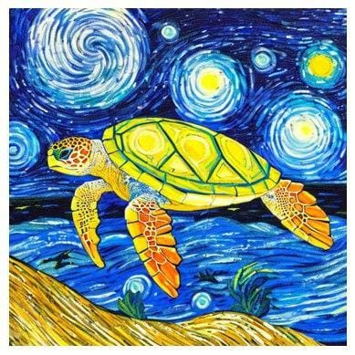

# 🧠 SIMG - Semillero de Investigación en Modelos Generativos

<div align="center">



**Research Seminar on Generative Models**  
Universidad Nacional de Colombia

[🌐 Website](https://simg-website.vercel.app) • [📚 Research](https://simg-website.vercel.app/en/research) • [👥 Team](https://simg-website.vercel.app/en/members) • [📧 Contact](https://simg-website.vercel.app/en/contact)

</div>

---

## 📖 About

The **SIMG** (Semillero de Investigación en Modelos Generativos) is a research seminar affiliated with the **Universidad Nacional de Colombia - UNAL**, dedicated to advancing the frontiers of artificial intelligence through rigorous research and collaborative innovation.

Our mission is to create a dynamic learning environment that introduces students to cutting-edge AI research, focusing on:

- 🔤 **Natural Language Processing (NLP)**
- 🧠 **Long Short-Term Memory (LSTM) Networks**
- ⚡ **Transformers & Attention Mechanisms**
- 🤖 **Autonomous AI Agents**
- 📊 **Benchmarks & Model Fine-tuning**
- 🎨 **Diffusion Models**

---

## 🎨 Design System

This website features a modern, Mistral AI-inspired design with:

- **Color Palette**: Orange primary (#f97316), Blue secondary (#0ea5e9)
- **Visual Effects**: Glassmorphism, radial gradients, smooth animations
- **Theme Support**: Dark/Light mode with persistent storage
- **Typography**: Responsive, clamp-based sizing with system fonts
- **Components**: Reusable design tokens and CSS custom properties

---

## 🚀 Tech Stack

- **[Astro 5.14.8](https://astro.build)** - Static Site Generator
- **[TypeScript](https://www.typescriptlang.org/)** - Type-safe development
- **CSS Custom Properties** - Comprehensive design token system
- **Content Collections** - Markdown-based content management
- **Node.js v24.11.0** - Runtime environment

---

## 📁 Project Structure

```text
SIMG_W_Website/
├── public/
│   ├── images/
│   │   └── website/          # Site images and assets
│   └── favicon.svg
├── src/
│   ├── components/
│   │   ├── Header.astro      # Navigation with theme toggle
│   │   └── SponsorCarousel.astro
│   ├── content/
│   │   ├── config.ts         # Content Collections config
│   │   ├── members/          # Team member profiles
│   │   ├── research/         # Research projects (en/es)
│   │   └── blog/             # Blog posts
│   ├── layouts/
│   │   └── Layout.astro      # Base layout with FOUC prevention
│   ├── pages/
│   │   ├── en/               # English pages
│   │   │   ├── index.astro
│   │   │   ├── about.astro
│   │   │   ├── research.astro
│   │   │   ├── members.astro
│   │   │   └── contact.astro
│   │   ├── es/               # Spanish pages
│   │   │   └── ...
│   │   └── index.astro       # Language redirect
│   └── styles/
│       └── global.css        # Design tokens & global styles
├── astro.config.mjs
├── package.json
├── tsconfig.json
└── CHANGELOG.md
```

---

## 🧞 Commands

Run from the project root:

| Command                | Action                                              |
| :--------------------- | :-------------------------------------------------- |
| `npm install`          | Install dependencies                                |
| `npm run dev`          | Start dev server at `localhost:4321`                |
| `npm run build`        | Build production site to `./dist/`                  |
| `npm run preview`      | Preview build locally before deploying              |
| `npm run astro ...`    | Run Astro CLI commands                              |

---

## 🌐 Pages

### 1. **Home** (`/`)

- Auto-redirects to preferred language (en/es)
- Hero section with gradient backgrounds
- Featured research preview
- Call-to-action sections

### 2. **About Us** (`/about`)

- Mission statement
- Research focus areas with interactive cards
- Team introduction

### 3. **Research** (`/research`)

- Filterable research projects grid
- Search functionality
- Category-based organization (Research, Products, Partnerships)

### 4. **Members** (`/members`)

- Team profiles with photos
- Research interests and links
- Alumni section

### 5. **Contact** (`/contact`)

- Contact form
- Social media links
- Meeting location information

---

## 🎯 Key Features

### Design System

- **600+ lines** of comprehensive CSS custom properties
- **Light/Dark Mode** with localStorage persistence
- **FOUC Prevention** via inline script in `<head>`
- **Glassmorphism** effects throughout
- **Responsive** design with mobile-first approach

### Color Identity

- Primary: Orange (#f97316, #ea580c)
- Secondary: Blue (#0ea5e9, #8b5cf6)
- Gradients: 50/50 orange-blue in text, orange-dominant in backgrounds

### Interactive Elements

- Theme toggle button (sun/moon icons)
- Language selector with hover dropdown
- Smooth scroll animations
- Hover effects with orange accents

---

## 🌍 Internationalization

The website supports both **English** and **Spanish** with:
- Parallel page structure (`/en/` and `/es/`)
- Automatic language detection from browser
- Manual language switching via header dropdown
- Bilingual content collections

---

## 🚢 Deployment

The site is optimized for deployment on:

- **Vercel** (recommended)
- **Netlify**
- **GitHub Pages**
- Any static hosting service

Build command: `npm run build`  
Output directory: `./dist/`

---

## 👥 Team

**Research Supervisor**: [Professor Name]  
**Student Leaders**: Multiple contributors  
**Alumni**: Past members who've contributed to the project

---

## 📺 Connect With Us

<div id="badges">
  <a href="https://www.linkedin.com/in/alejandrosanchezpoveda/">
    
  </a>
  <a href="https://www.youtube.com/channel/UCI5h3tbo4s7VE-VuMMYptYw">
    
  </a>
  <a href="https://x.com/Asperjasp/">
    
  </a>
  <a href="https://www.instagram.com/alejosanchezpoveda/">
    
  </a>
  <a href="https://github.com/Asperjasp">
    
  </a>
  <a href="https://linktr.ee/Asperjasp">
    
  </a>
</div>

---

## 📄 License

This project is maintained by the SIMG research seminar at Universidad Nacional de Colombia.

---

## 🤝 Contributing

We welcome contributions! Please feel free to submit issues or pull requests.

For major changes, please open an issue first to discuss what you would like to change.

---

<div align="center">

**Made with ❤️ by the SIMG Team**

[⬆ Back to Top](#-simg---semillero-de-investigación-en-modelos-generativos)

</div>
